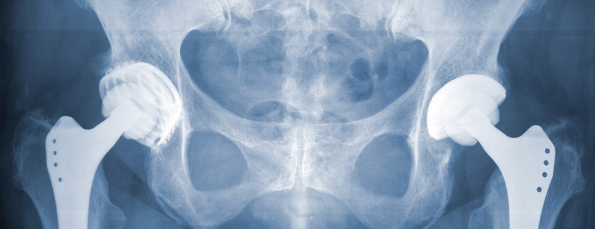
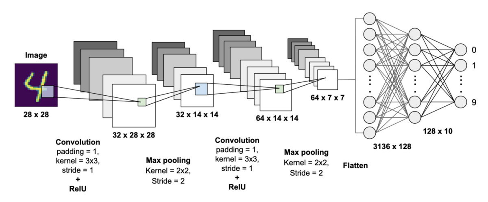

# Shadane's Data Science Portfolio

Here are some of my best Data Science Projects. I have explored various machine-learning algorithms for different datasets. Feel free to contact me to learn more about my experience working with these projects.

***

[Examining the effect of environmental factors and weather on Bike rentals](https://github.com/Shads2290/shadane-williams.github.io/blob/master/Projects/Linear_reg_project.ipynb)

- Used Linear Regression to predict the number of bikes rented in the city of Seoul
- The data had quite a few categorical variables which were encoded for use in the model
- Encoded categorical variables to numeric using Sklearn due to the presence of many string columns
- Fit a multiple linear regression model with high prediction accuracy through iteration

***

[Identifying Customers Likely to Subscribe for Term Deposit](https://colab.research.google.com/drive/1h3Rnc_h4cgTWTaLEYmQDgoLqIJdiNlsc)

- Used logistic regression to identify potential bankers based on various attributes
- Implemented SMOTE to balance class labels
- Used Logistic regression classifier & optimized the accuracy by using the ROC curve
- Created the confusion matrix for the predictions and make note of the outputs
- Created a classification report and eplored the various outputs
- Model had an accuracy score 90.1%

***

[Identifying possible click fraud by legitimizing user atributes](https://colab.research.google.com/drive/1UqxyiKf465NEJ0hPZpT3DYRA4bJE7FCh)

- Used the features associated with clicks, such as IP address, operating system, device type, time of click etc. to predict the probability of a click being fraud.
- Used the Random Forest, Bagging classifier, and XGBoost classifier
- Used these three models to distinguige click fraud base on accuracy
- Selected best model based on train and test performance
- XGBoost Classifier model had an accuracy score 99.7%

***

[Identifying symptoms of orthopedic patients as normal or abnormal](https://colab.research.google.com/drive/1Sk_SQlq-TWaYNEpIgdz4l3TOttzcIYcS?usp=sharing)

- Used the K Nearest Neighbours algorithm to classify a patient's condition as normal or abnormal based on various orthopedic parameters
- Compared predictive performance by fitting a Naive Bayes model to the data
- Selected best model based on train and test performance
- The accuracy of the KNN with K=3 is 83.33%, while Best accuracy is 87.1% with K = 9 with fine tuned parameters implemented.
***

[Identifying total compensation based on a vareity of benefits provided by the San Francisco Controller's Office](https://colab.research.google.com/drive/1r8buRPpTT-F009BI0mFsToJrf5bMYfdM#scrollTo=OWR6XNB4A5Gi)

- Used the K Nearest Neighbours algorithm to total compensation of employees on various atributes
- Compared predictive performance by fitting a Naive Bayes model to the data
- Selected best model based on train and test performance
***

[Used PCA to identify most important atributes to accurately predict housing market](https://colab.research.google.com/drive/1qLA_6kUuqd9vT_KfFzq2qxQZp40XEuZh)

- Used principle component analysis to reduce non important atributes to better estimate house market value
- Scale data for best PCA consants without loss of information
- Found number of components with at least a 90% variance
***

[Using NLP to determine whether the review is positive or negative](https://colab.research.google.com/drive/1aoQel3nYgHOJAWllF-56BQdoG3xiV4fN)

- Used the SQLite Table to read data
- Used HelpfulnessNumerator, set of stopwords, snowball stemmer and cleanpunc functions to prepare data for futher analysis
- Used the countvectorizer to train data and observe output. 

***

[Used CNN model to identify images between a dog or a cat](https://colab.research.google.com/drive/1rvMGRZg5jFbRNBBKpVkIrA-javVkPkKs)

- Used convolution neuro network model to train a series of pictures of dogs and cats
- There are two convolution layers with relu activatioon with two pooling layers of 2x2 kernels with 2 step stride
  following the flattening stage.
- The full conection stage uses relu activation with a sigmoid output to hold within 0 to 1 boundaries
- Selected best parameters based on train and test performance using 20 epochs
- The model identifies dogs and cats with 83% accuracy

***

[Deep Neural Network with Keras for MNIST handwritten classification and recognition](https://colab.research.google.com/drive/1t7NiTczdrYY6BqL0umevKVKkr73Y8mUz)

- Developed a driver block to develop a working model and establish a few baseline architecture for a classification task.
- Improved the performance of the model through two different processes.
- Created a finalized model and then used it to create predictions on new images.
